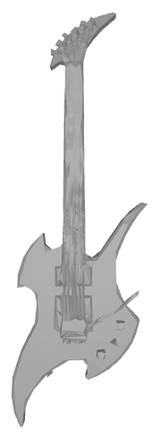

# height-persist

*3D object classification using the Persistent Homology Transform (PHT).*

This project contains code for classifying 3D objects in the form of CAD models using  
Persistent homology transform (PHT). More information about the PHT can be found in the paper
[Persistent homology transform for modeling shapes and surfaces](https://doi.org/10.1093/imaiai/iau011). 

  
   

## Files

### core

Contains the core code for converting CAD models into persistence diagrams.

- core/surface.py: This file converts the CAD models from obj format and loads it into
the simplextree data structure, computes and stores the persistence diagrams in the features
folder.

- core/sphere_sampler.py: Functions for sampling uniform evenly distributed directions from the sphere.

- core/obj_utils.py: Loads obj files into python.

- core/off_utils.py: Loads offf files into python.

 

 

### scripts

Contains various scripts for preprocessing the CAD models, generating the persistence diagrams
and passing them through standard ML pipelines.

- scripts/generate_features.py: Takes a folder containing a dataset of 3D CAD models and outputs the corresponding
persistence diagrams inside a features folder maintaining the directory structure of the dataset.

- scripts/install_script.bash: This script needs to be run to install the core functions to be used by the scripts.

- scripts/randomforest: Randomforest classifier for the [ModelNet40](https://modelnet.cs.princeton.edu/) dataset.

- scripts/pytorch: Neural network classifier for the [ModelNet40](https://modelnet.cs.princeton.edu/) dataset (in progress). 

- scripts/dataprep: Various tools for preprocessing the CAD models.

### test

Various simple test routines for the functions in core.

## Notes

- The CAD models are preprocessed by reducing the number of faces to 2000 and converting to manifolds. 
- We obtain around 80% test set accuracy in the ModelNet40 dataset using a simple RandomForest classifier with 100 nodes.

